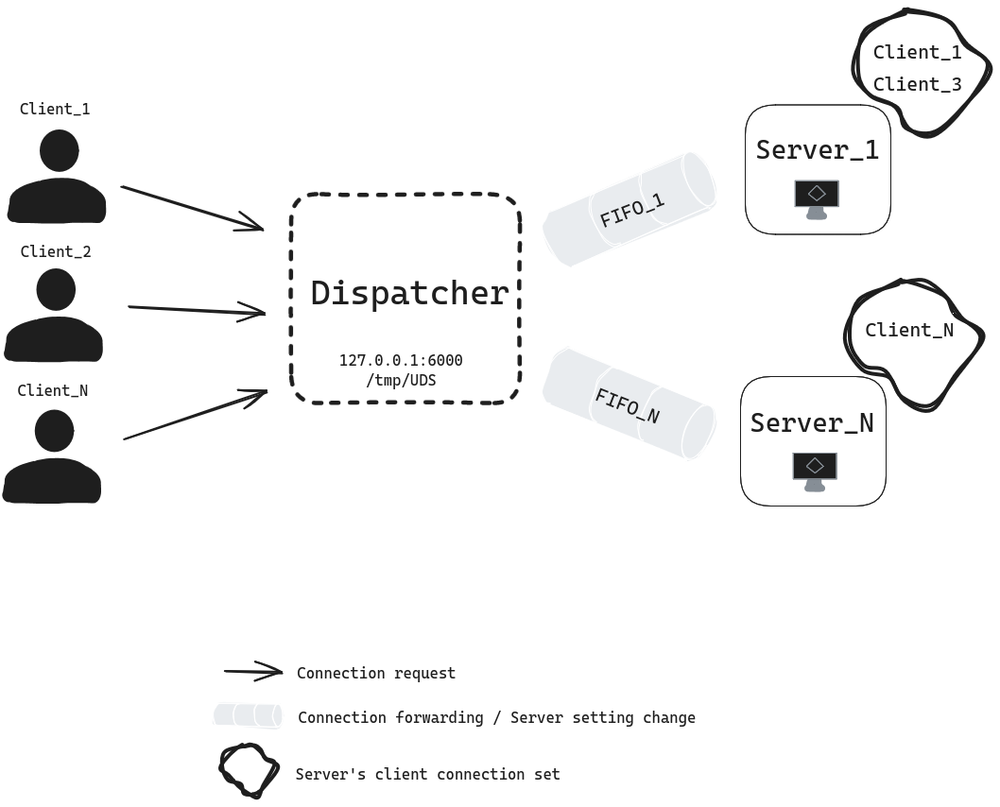

## Overview
Server-client architecture written for Linux (5.6 or higher), including features such as:
* Multiple server support with the load balancing layer dispatching incoming connections using serialized inter-process communication
* Extensible listener socket options, supporting Internet and Unix domain sockets
* I/O multiplexing for handling concurrent client connections
* Startup and runtime configurable server response generation algorithms

 

## Usage
* Build the project using `./scripts/build.sh`

* Run the load balancer/dispatcher using `./build/src/dispatcher`. You can run commands on startup or during runtime. Run `--set-response-schema [EQUIVALENT/REVERSE/CENSORED CHAR=c/PALINDROME]` to change the response schema of the servers

* Run the client using `./build/src/echo_client localhost 6000` or `./build/src/echo_client /tmp/unix_socket` and enter your message into the CLI

## Tests
* To run all tests, use `./scripts/run_tests.sh`. 